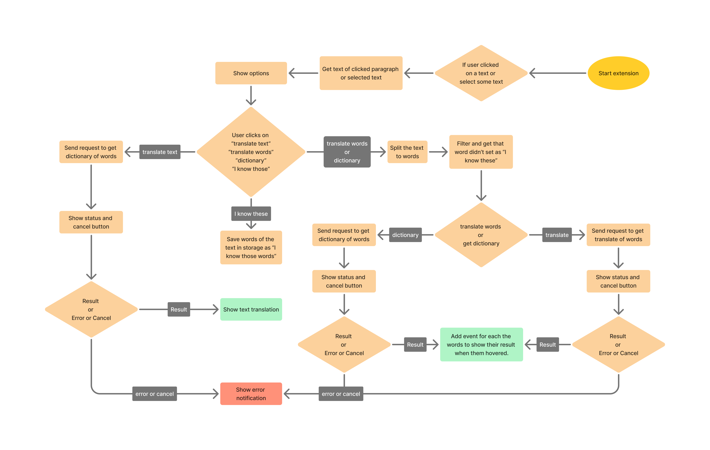

# Project Roadmap

## Phase 1: Start

- [x] Start project

## Phase 2: Configs of app

- [-] Configuration operations Get, Save, Update and etc apis. (Redux)
- [-] Create Option page to config app settings (Shad cn UI, Tailwind css, Framer-motion)

## Phase 3: Show options

- [ ] Operation of show a container at correct place. (Below or above a text or the position the user set or etc.)
- [ ] Operation to move the container in window and save container's position that set by user.
- [ ] Show options when the user clicks or selects text. (React, Framer-motion, Shad cn UI optional)
- [ ] Show a timer and cancel button in options container to display status of translation and able to cancel it. The translations will cancelled after 1 minute. There should be a section to display list of running translations in background and able to cancel them. (React, Framer-motion, Shad cn UI optional)

## Phase 4: Translation or dictionary

- [ ] Operation of get text of clicked paragraph or selected text.
- [ ] Operation of translate or get dictionary.
- [ ] Operation of split text to words and filter them to get the words that didn't set as 'I know these'. (Redux)

## Phase 5: Show result

- [ ] Operation of show the container at correct place when the user hovered the specific word. (React, Framer-motion)
- [ ] Show result when the user hover the word. (if user clicked "translate words" or "dictionary" in options) + (React, Framer-motion)
- [ ] Show result (if user clicked "translate text")
- [ ] Set words of the text as "I know these" if user clicked "I know these words" button in options. (Redux)

## Feature considerations

- Translate automatic if number of paragraph words is more than 30
- Add leitner box option

---

---

## In processing task: Create Option page to config app settings.

- [x] Learn tailwind css
- [x] Learn redux
- [x] Learn framer-motion
- [x] Decide what settings the extension will have
- [x] I remade the structure of project.
- [x] I made the config types and config slice. 
- [-] Write settings form in options page
- [-] I made some part of options page, but it's not complete.
- [ ] connect store to Storage api of extension.
- [ ] The ROADMAP.md and README.md files need update. The structure of project, used libraries, etc should add.

---

---

### Status explanation

    I created the store and slice of configs and I created the first part of options page (select result language), but it's not done for now.
